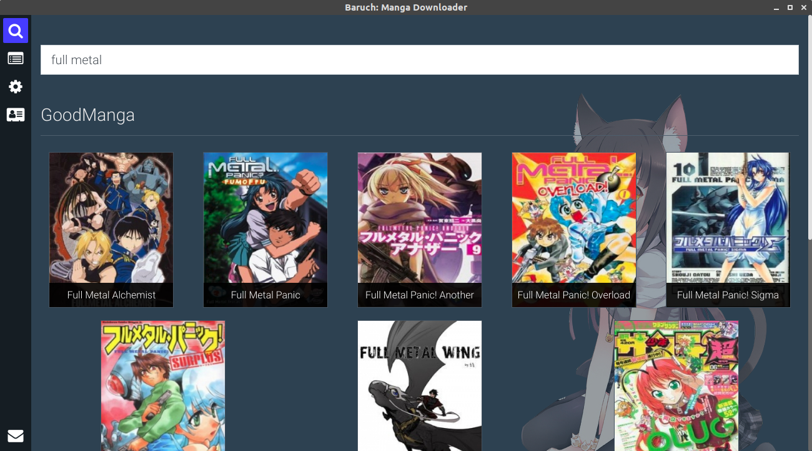
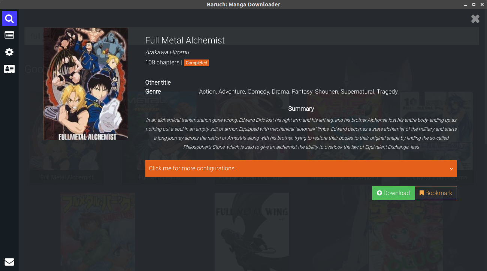
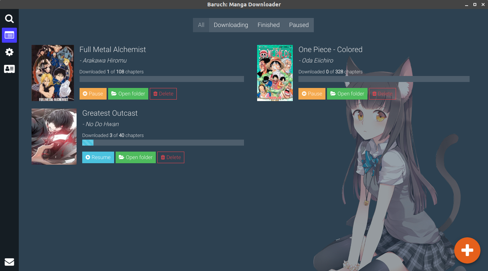
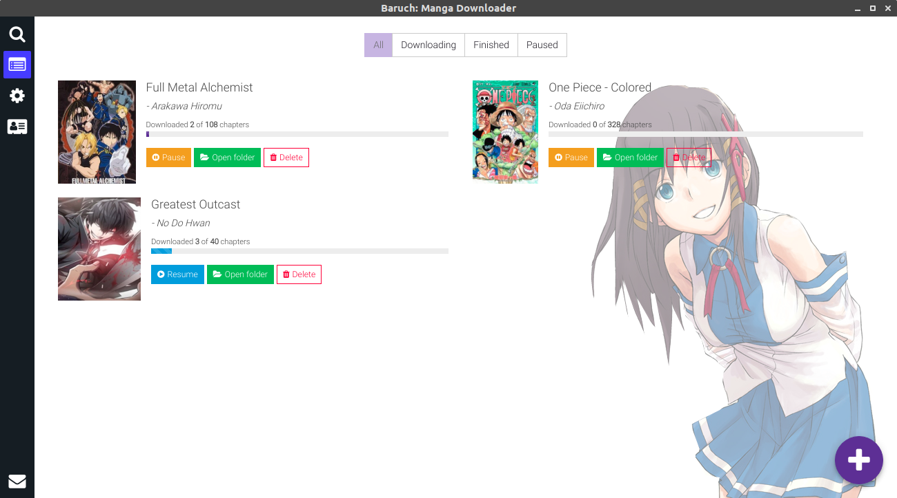
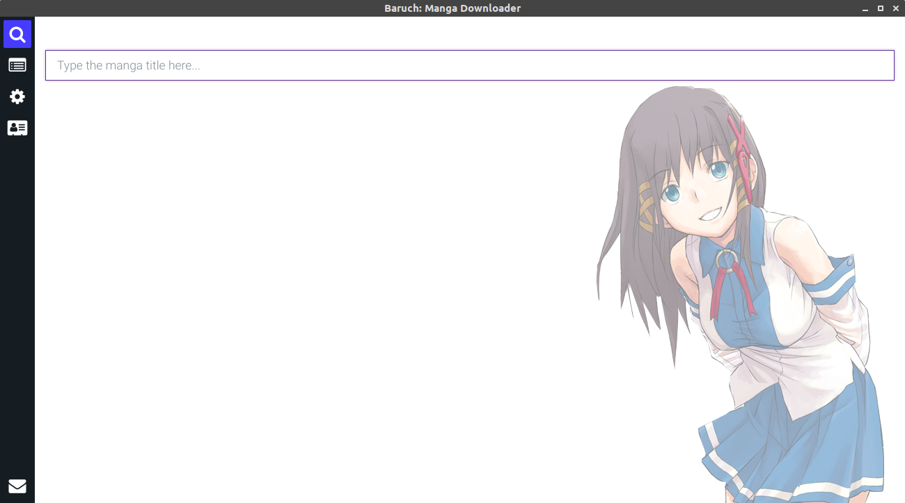
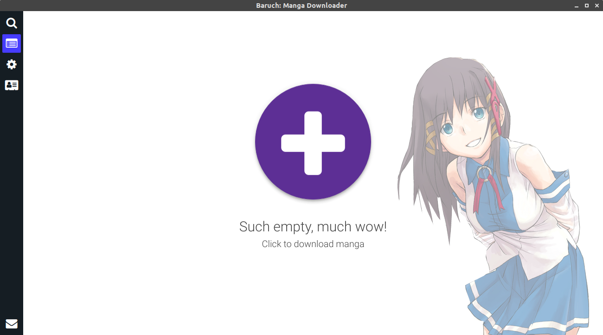

  
Baruch: Manga Downloader  

======  
**Baruch: Manga Downloader**  is as its name says, a manga downloader. It's a desktop application that runs on major platforms (e.g. Windows, Linux, OSX).

## Download
* [Windows](https://github.com/adrianonrails/manga-downloader/releases/download/v0.0.5/baruch-manga-downloader-setup-0.0.5.exe)
* Linux
    - [deb](https://github.com/adrianonrails/manga-downloader/releases/download/v0.0.5/baruch-manga-downloader_0.0.5_amd64.deb) 
    - [AppImage](https://github.com/adrianonrails/manga-downloader/releases/download/v0.0.5/baruch-manga-downloader-0.0.5-x86_64.AppImage)
        > Give an executable permission to the file so that you can run it  
        `chmod +x baruchmangadownloaderfile.appimage` 
* [OSX](https://github.com/adrianonrails/manga-downloader/releases/download/v0.0.5/baruch-manga-downloader-0.0.5.dmg)

## Features
- [x] Search manga
- [x] Download manga
- [x] Chapter selection
- [x] Compress chapters to CBZ
- [x] Manga sources (GoodManga, MangaReader)
- [x] Friendly UI
- [x] Dark mode / Light mode
### Upcoming Features
- [ ] Auto update manga
- [ ] Add more sources
- [ ] Bookmark
#### Want to request a feature? [Submit a request.](https://github.com/adrianonrails/manga-downloader/issues/new)
#### Found some bugs? [Report it here.](https://github.com/adrianonrails/manga-downloader/issues/new)

## Screenshots
- Search Page  
    

- Manga info  
    

- Downloads list  
    

- Light mode  
    
    
    

## Contributors

### Contributors on GitHub
* [Contributors](https://github.com/adrianonrails/manga-downloader/graphs/contributors)

## License 
* see [LICENSE](https://github.com/adrianonrails/manga-downloader/blob/master/LICENSE) file

## Contact
### Your dev
* e-mail: adrian.onrails@gmail.com

## Support your dev

## Disclaimer
The manga that you downloaded using this app are not mine and are just crawled from other aggregators.