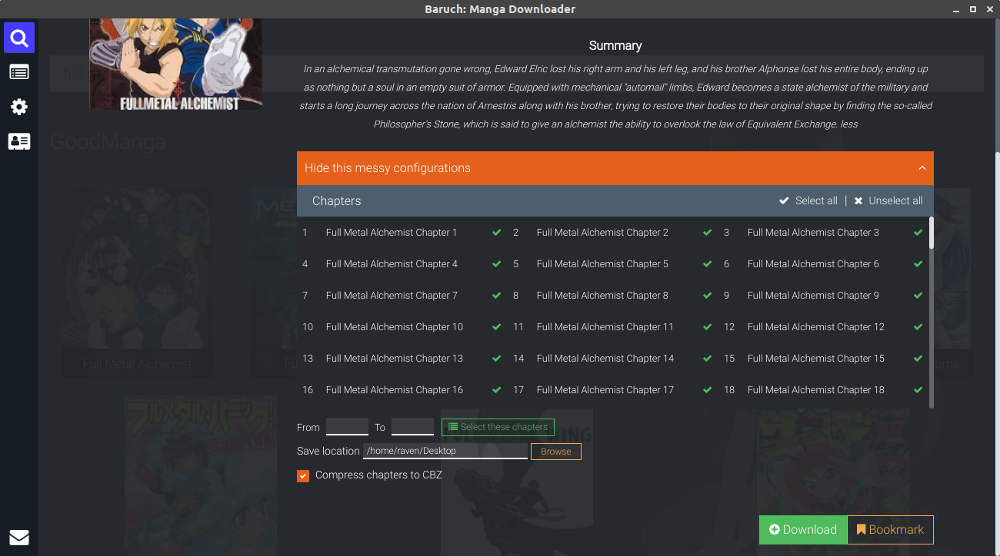
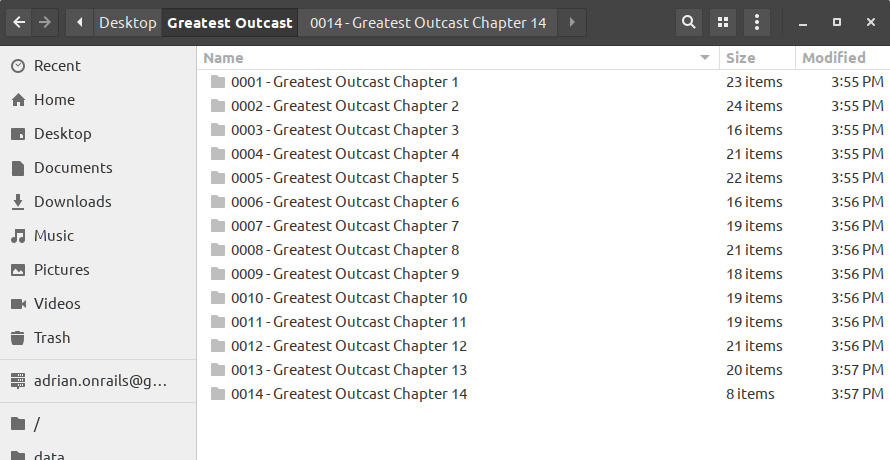

Baruch: Manga Downloader  

======
**Baruch: Manga Downloader**  is as its name says, a manga downloader. It's a desktop application that runs on major platforms (e.g. Windows, Linux, MacOSX).

## Download
* [Windows]()
* Linux
    - [Deb]() 
    - [AppImage]() 
* [MacOSX]()

## Features
### Implemented Features
- [x] Search manga
- [x] Download manga
- [x] Chapter selection
- [x] Compress chapters to CBZ
- [x] Manga sources (GoodManga, MangaReader)
- [x] Friendly UI
- [x] Dark mode / Light mode
### Upcoming Features
- [ ] Auto update manga
- [ ] Add more sources
- [ ] Bookmark
#### Want to request a feature? [Submit a request.](https://github.com/adrianonrails/manga-downloader/issues/new)
#### Found some bugs? [Report it here.](https://github.com/adrianonrails/manga-downloader/issues/new)

## Screenshot
- Search Page  
    

- Manga info  
    

- Additional download configurations  
    

- Downloads list  
    

- Output (folder)  
    

- Light mode  
    
    
    

## Contributors

### Contributors on GitHub
* [Contributors](https://github.com/adrianonrails/manga-downloader/graphs/contributors)

## License 
* see [LICENSE](https://github.com/adrianonrails/manga-downloader/blob/master/LICENSE) file

## Contact
### Your dev
* e-mail: adrian.onrails@gmail.com

## Support your dev
  
Or via paypal 

## Disclaimer
The manga that you downloaded using this app are not mine and are just crawled from other aggregators.